# TOP WAR AUTOMATION

Download on [Play store](https://play.google.com/store/apps/details?id=com.topwar.gp)

### Requirement
1. python3
2. ADB tools [link](https://developer.android.com/studio/command-line/adb)
3. Enable `developer option` on Andriod
4. Recommend screen size: `900 x 1600`

### How to run
1. ` pip install -r requirements.txt `
2. Open Top War game
3. `python3 Topwar.py`


### Feature
1. Auto Farm Warhammer
1. Auto check remaining vit
1. Auto use vit item
1. Auto check available march queue
1. Auto join guidl rally

### Instruction
There are some required parameters, you need to fill this with your information
- `max_queue`: the maximum number of your march queue ex.5
- `is_allow_add_vit`: if you set this flag as `True`, it will auto use your VIT capsure when it doesn't have enough VIT to use
- `is_allow10vit`: if you set this flag as `True`, it will only use your small VIT capsure
- `is_allow50vit`: if you set this flag as `True`, it will only use your Large VIT capsure
- `war_hammer_level`: level of war hammer you can only put 10, 20, 30, 40 or 50

### Set up & Limitation
- **important1** you need to set your warhammer formation at 2nd formation
- **important2** please go to `config.json` to set your position depend on your screen size
- it will freeze at some page and you need to manually go to base/world map
- your current vit can't exceed 100 otherwise it can't get the VIT

### Show Case


### Configuration
```
// format 
(x1,y1) is TOP LEFT corner of red rectangle
(x2,y2) is BOTTOM RIGHT corner of red rectangle
"name_area" : {
        "pos" : {
            "x" : [x1,x2],
            "y": [y1,y2]
        }
    }

(x1, y2) is the coordination of red point
"name_btn" : {
        "pos" : {
            "x" : x1,
            "y": y1
        }
    }
```
1. vit_area 
- 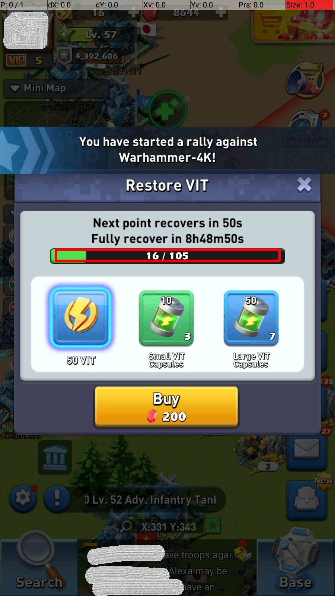
2. vit_item_area
- 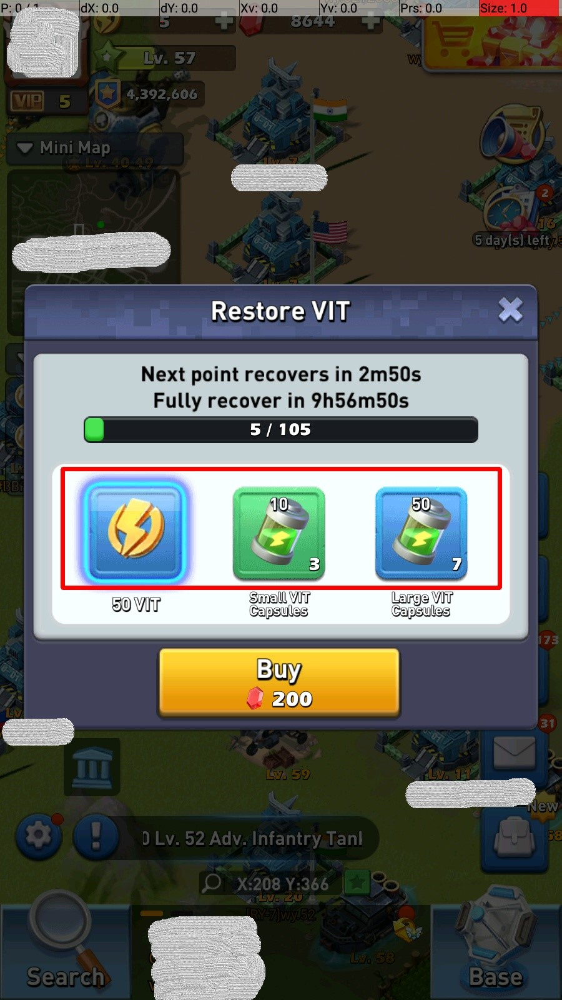
3. select_hero_area
- 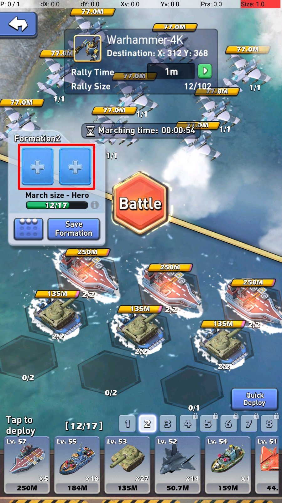
4. march_queue_area **please get rectangle cover only up to your max queue**
- 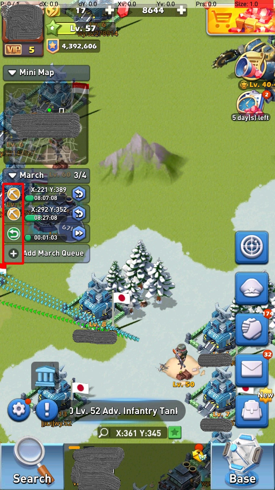
5. bottom_menu_area
- 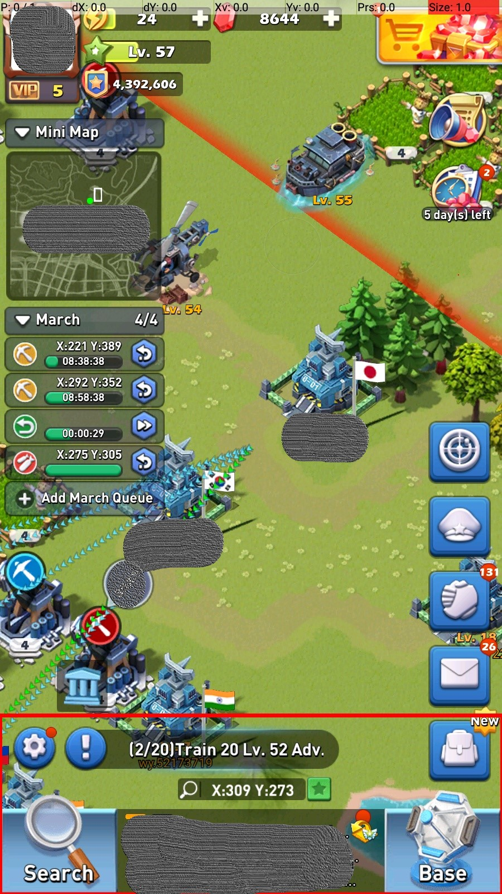
6. vit_bar_btn
- 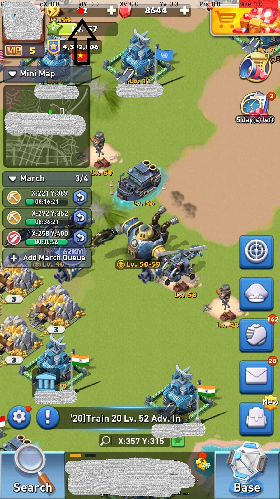
7. close_btn
- 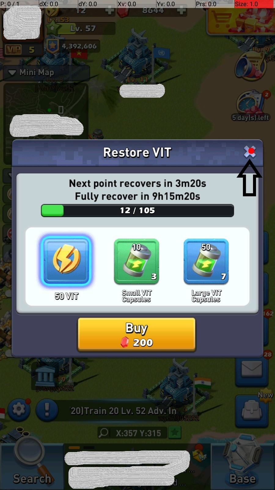
8. use_btn
- 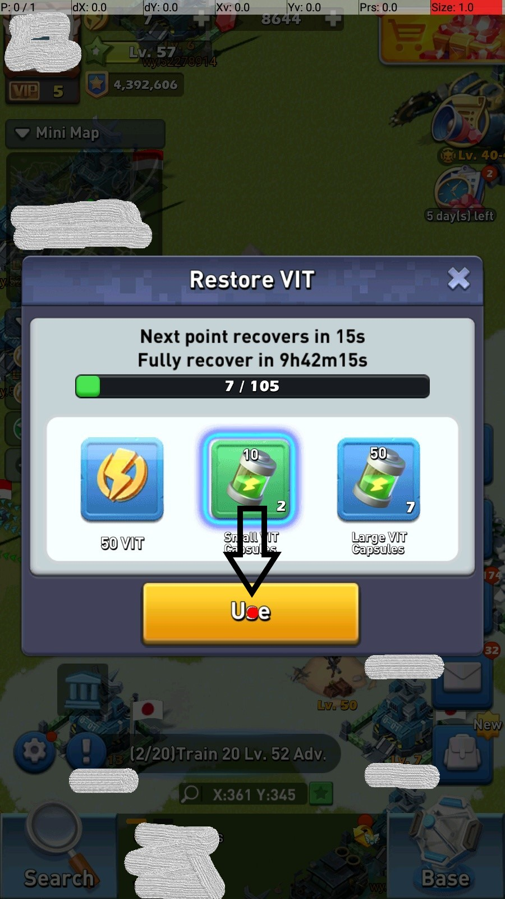
9.  back_btn
- 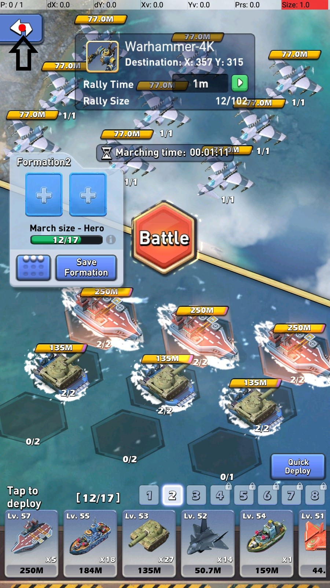
10. ok_btn
- 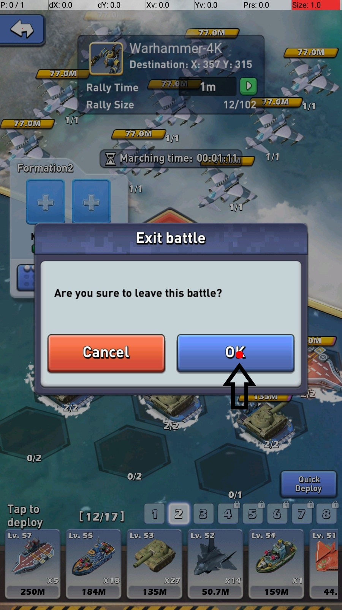
11. rally_btn
- 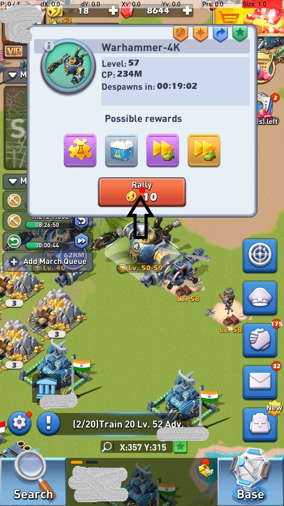
12. formation_2_btn
- 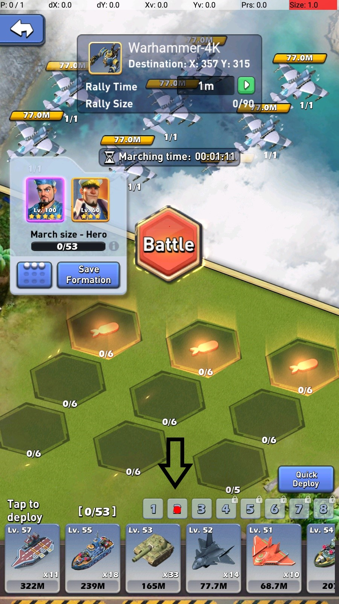
14. battle_btn
- 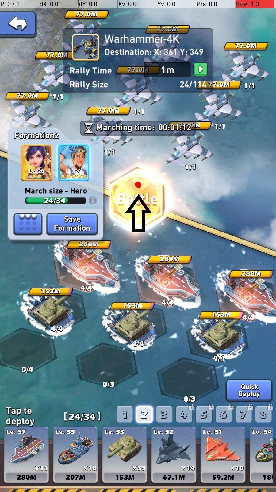
15. click rally tap
- 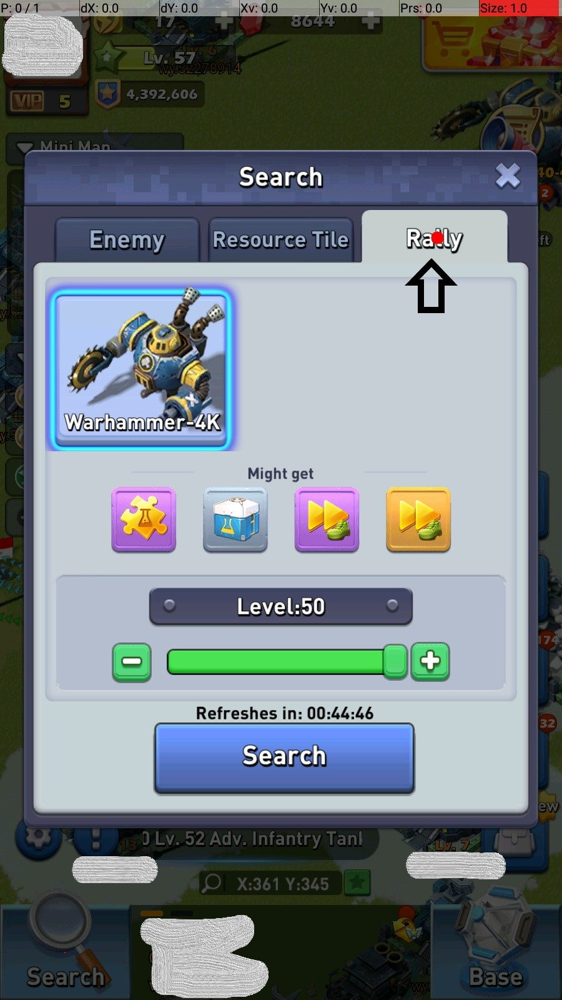    
12. click warhammer icon
- 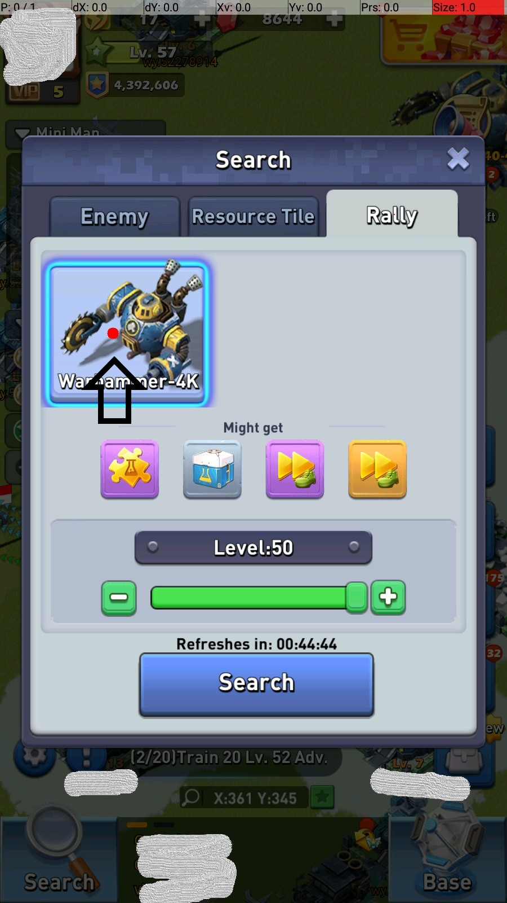    
13. click add level
- 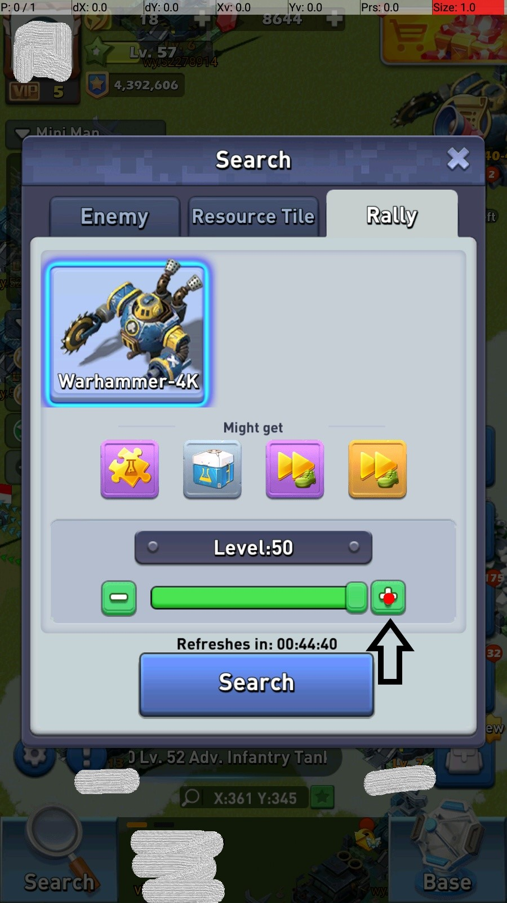    
14. click search button
- 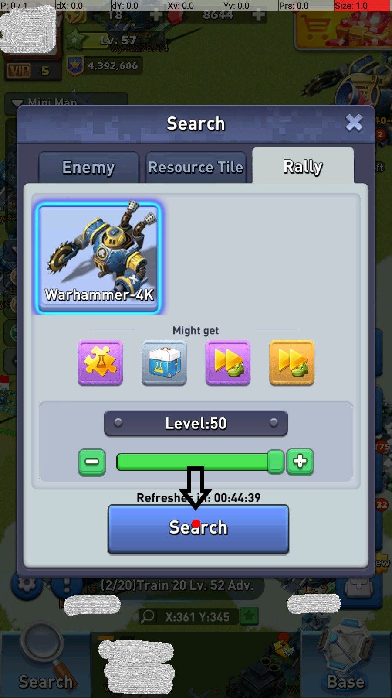    
15. click warhammer model
- 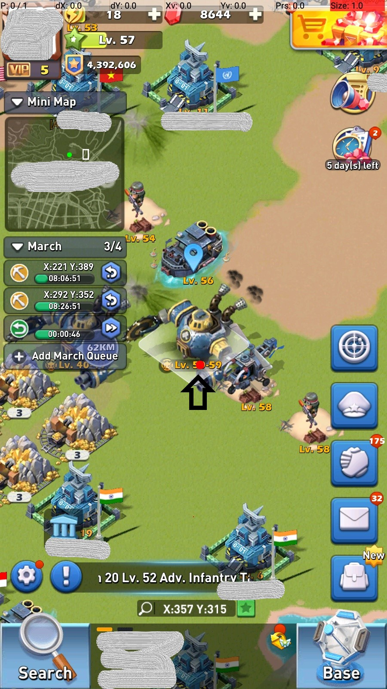    